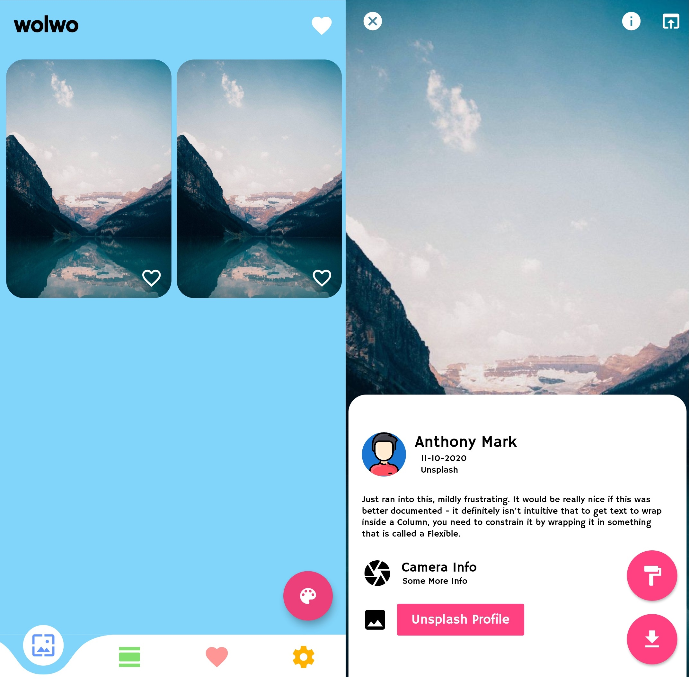
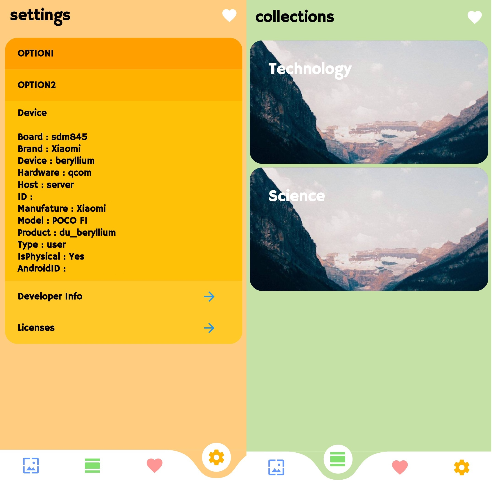

<h1 align="center">
   
  
   
    wolwo
   
</h1>

<h4 align="center">An opensource wallpaper app built using flutter and unsplash API</h4>
 

## Getting Started

This project is a starting point for a Flutter application.
A few resources to get you started if this is your first Flutter project:

- [Lab: Write your first Flutter app](https://flutter.dev/docs/get-started/codelab)
- [Cookbook: Useful Flutter samples](https://flutter.dev/docs/cookbook)
  For help getting started with Flutter, view our
  [online documentation](https://flutter.dev/docs), which offers tutorials, samples, guidance on mobile development, and a full API reference.
 
## Progress

- Wall Page Layout Ready
- Wall Setter Ready
- Setting Layout Ready
- About Layout Ready

## License

By [Yashwant](https://github.com/meyash)

## Contributors

 

 

  
