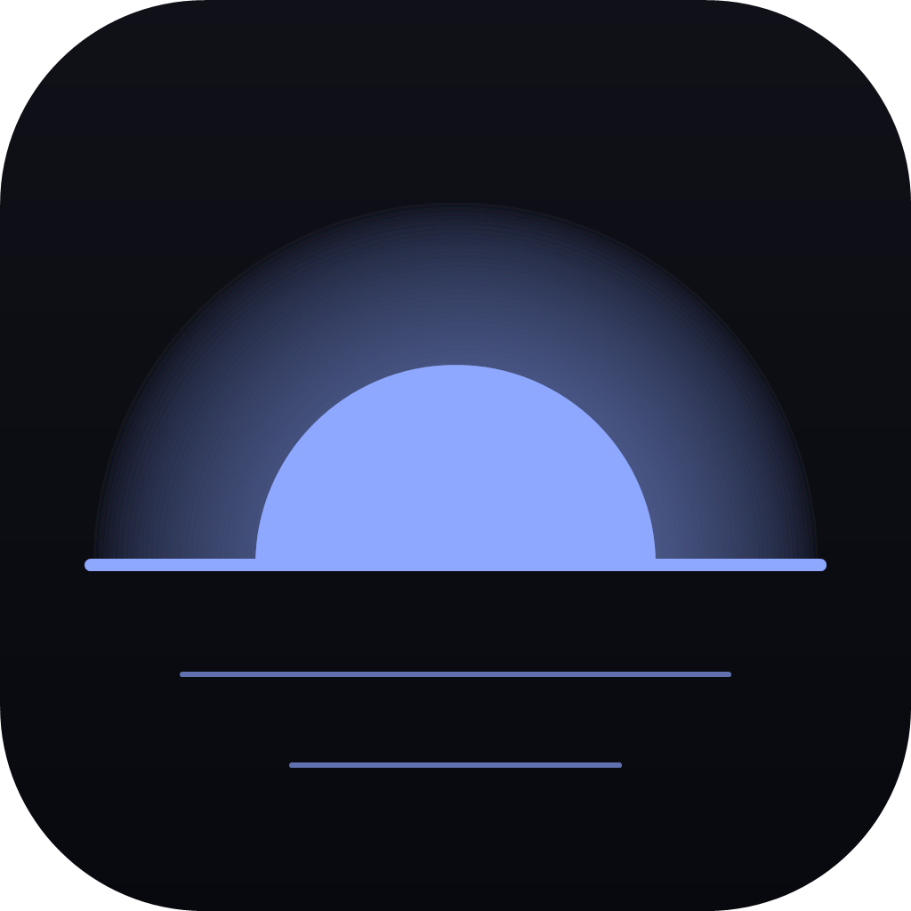
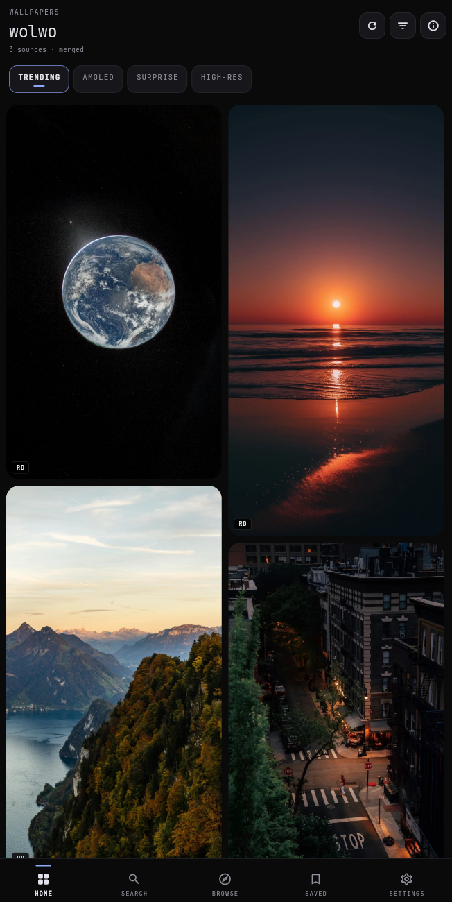
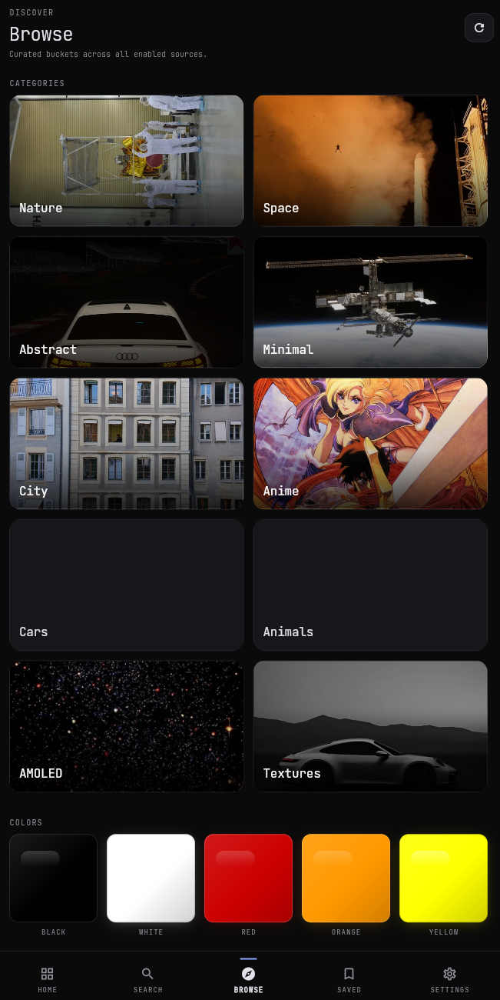
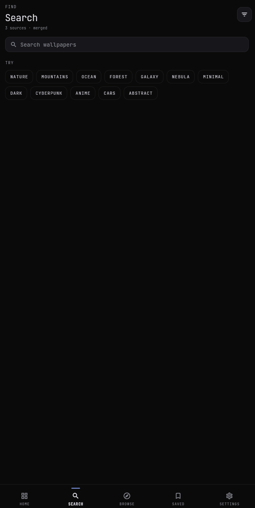
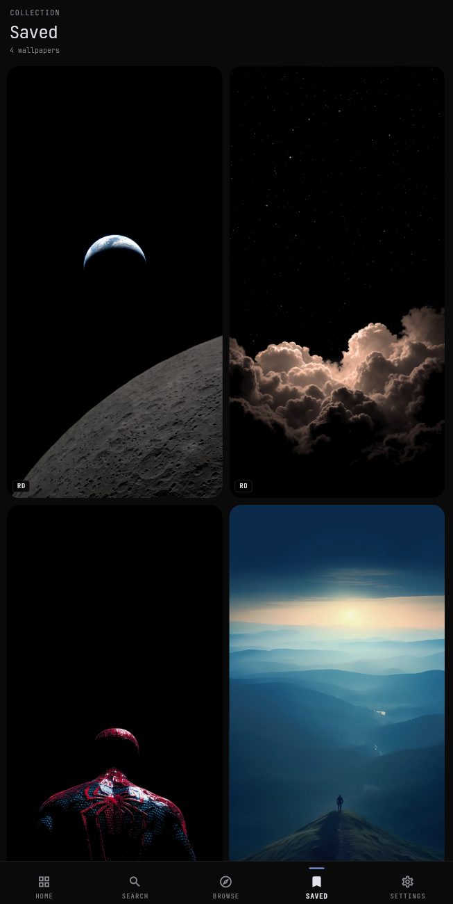
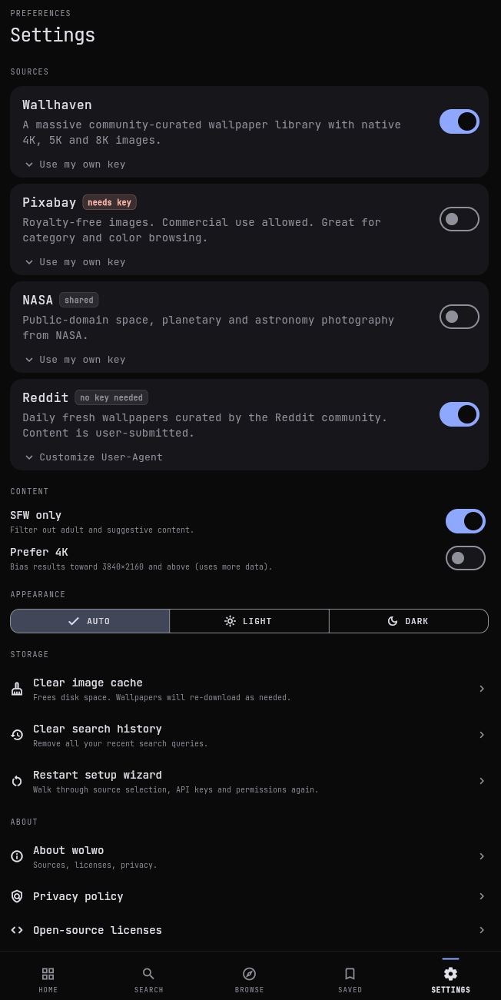
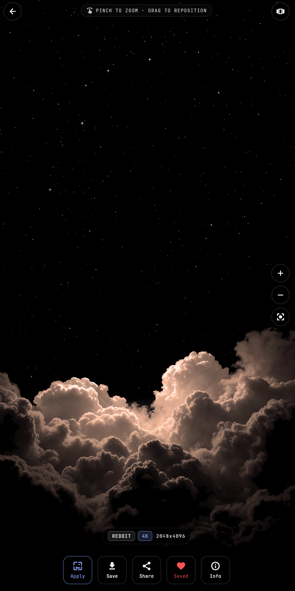

<div align="center">



# wolwo

**A quiet, opinionated wallpaper browser.**

Phone-shaped 4K wallpapers from Wallhaven, Pixabay, NASA and Reddit —
merged into one feed, no login, no ads, no analytics, no cloud.

[](https://github.com/iyashwantsaini/wolwo/actions/workflows/ci.yml)
[](https://github.com/iyashwantsaini/wolwo/actions/workflows/release.yml)
[](LICENSE)
[](https://flutter.dev)
[](https://developer.android.com)

[Download APK](https://github.com/iyashwantsaini/wolwo/releases/latest) ·
[Releasing guide](docs/RELEASING.md) ·
[Privacy](PRIVACY.md)

</div>

---

## Why wolwo

Most wallpaper apps are 70% ad SDK, 20% recommendation engine and 10%
wallpapers. wolwo is the opposite. The whole app is about **finding a
nice picture, applying it, and getting out of your way.**

- **Multi-source merge** — Wallhaven · Pixabay · NASA · Reddit, round-robin
  interleaved with a per-tile quality score so the strongest tiles surface
  first.
- **Phone-shaped only** — every grid tile is portrait and high-resolution.
  We aggressively filter out landscape photos, screenshots, memes, square
  posts, and OLED test patterns.
- **Considered aesthetic** — JetBrains Mono, hairline borders, ALL-CAPS
  labels, an animated square-tick loader, three-step onboarding rail.
- **Local-first** — favourites, search history, recents, settings, and
  even the Browse cover thumbnails all live in `SharedPreferences`. No
  account ever touches the network.
- **Multiple viewer layouts** — toggle between a scrolling action bar
  and a vertical icon stack on the wallpaper detail page.

---

## Table of contents

- [Screenshots](#screenshots)
- [The four feeds](#the-four-feeds)
- [Page-by-page tour](#page-by-page-tour)
- [Architecture](#architecture)
- [The merge algorithm](#the-merge-algorithm)
- [Building locally](#building-locally)
- [Cutting a release](#cutting-a-release)
- [Roadmap](#roadmap)
- [License & attribution](#license--attribution)

---

## Screenshots

<table>
  <tr>
    <td align="center" width="33%">
      <br/>
      <sub><b>Home</b><br/>Trending feed, merged across all sources</sub>
    </td>
    <td align="center" width="33%">
      <br/>
      <sub><b>Browse</b><br/>12 curated categories + colour wall</sub>
    </td>
    <td align="center" width="33%">
      <br/>
      <sub><b>Search</b><br/>Recent + suggested topic chips</sub>
    </td>
  </tr>
  <tr>
    <td align="center" width="33%">
      <br/>
      <sub><b>Saved</b><br/>Favourites stored locally, no account</sub>
    </td>
    <td align="center" width="33%">
      <br/>
      <sub><b>Settings</b><br/>Sources, keys, theme, storage</sub>
    </td>
    <td align="center" width="33%">
      <br/>
      <sub><b>Detail</b><br/>Pinch-to-zoom viewer with apply/save/share</sub>
    </td>
  </tr>
</table>

---

## The four feeds

The home page exposes four curated feeds, each backed by a different
upstream sort / filter combination.

| Tab | What it asks each source for | When to use |
| --- | --- | --- |
| **Trending** *(default)* | Each source's editorial / toplist endpoint (`FeedKind.curated`) | The "what's good this week" feed. |
| **AMOLED** | Dark / black-dominant category (`FeedKind.category`, `amoled`) | OLED-friendly true-black wallpapers. |
| **Surprise** | Random pull with a fresh seed each visit (`FeedKind.random`) | Doom-scroll discovery. |
| **High-Res** | 4K-only filter (`FeedKind.fourK`) | Tablets, foldables, anywhere extra resolution shows. |

Each feed merges every enabled source. You can pin to a single source
(e.g. "Wallhaven only") via the source-filter sheet in the header.

---

## Page-by-page tour

### 1. Onboarding (4 steps)

Mono-typed first-run flow. Numbered step rail, ALL-CAPS eyebrow
labels, a 56-pixel light-weight `wolwo` wordmark on the welcome screen.

1. **Welcome** — what wolwo is, what it touches, what it doesn't.
2. **Sources** — toggle Wallhaven / Pixabay / NASA / Reddit.
3. **API keys** — paste your own Pixabay / Wallhaven / NASA keys
   (optional but recommended for higher rate limits).
4. **Permissions** — request gallery access for "Save to phone".

Skip is always available; everything is changeable later in Settings.

### 2. Home

Bottom-nav root. Trending feed by default. Pull-to-refresh shuffles the
seed; the header source pill opens the source-filter sheet; the
top-right refresh icon clears all caches and reloads.

### 3. Browse (Categories)

A 2-column masonry of 12 hand-curated categories: Nature, Space, Cars,
Anime, Minimal, Abstract, AMOLED, Cyberpunk, Architecture, Animals,
City, Texture. Tapping a card pushes a category-scoped feed.

Each cover is **persisted to SharedPreferences for 15 minutes** so the
page paints with real images the moment you open it instead of always
showing shimmer placeholders. Pull-to-refresh forces a fresh pick for
every tile.

### 4. Search

Free-text search across every source that supports it. The empty state
shows your eight most recent queries (one-tap to re-run) plus a few
canned suggestions ("4k nature", "minimal black", "space"…). Long-press
a recent chip to remove it.

### 5. Favourites

Everything you've hearted, newest first. Long-press a tile to unfavourite
in place. All data lives in `SharedPreferences` — nothing leaves the
device.

### 6. Settings

- **Sources** — per-source on/off toggles.
- **API keys** — paste your own; the field shows a masked preview after
  you paste so you know it took.
- **SFW only** — global toggle (defaults on).
- **Theme** — System / Light / Dark.
- **Restart setup** — re-runs onboarding for testing.
- **About** — version, license, source links.

### 7. Wallpaper detail (the real money page)

Pinch-to-zoom, drag-to-reposition. The "Apply Wallpaper" CTA opens the
system wallpaper picker pre-cropped to whatever you've panned to.

Two viewer layouts, cycle by tapping the layout button top-right
(long-press to reset to bar):

- **BAR** — original scrolling pill row of icons across the bottom.
- **COMPACT** — vertical icon stack pinned bottom-right so the wallpaper
  stays maximally unobstructed.

A small `LOADING HI-RES` pill appears at the top while the full-resolution
image is downloading on top of the smaller preview.

---

## Architecture

```text
lib/
├── main.dart                    # entry, prefs init, edge-to-edge, theme bootstrap
├── app/
│   ├── app.dart                 # MaterialApp.router + theme glue
│   ├── router.dart              # go_router config (shell + detail route)
│   └── providers.dart           # Riverpod root: settings, sources, repository
├── core/
│   ├── config/                  # ApiKeys, AppConfig
│   ├── net/                     # ImageProxy (bad-host bypass), NetworkImageWithFallback
│   ├── network/                 # DioFactory (cached HTTP via Hive store)
│   └── theme/                   # design_tokens.dart (Tk + TkUI helpers)
├── data/
│   ├── models/                  # Wallpaper, FeedQuery, PagedResult, AppCategory
│   ├── sources/                 # WallpaperSource interface + 4 implementations
│   │   ├── wallhaven_source.dart
│   │   ├── pixabay_source.dart
│   │   ├── nasa_source.dart
│   │   └── reddit_source.dart
│   ├── repositories/
│   │   └── wallpaper_repository.dart   # the merge / quality / cache layer
│   └── local/
│       ├── app_settings.dart    # all persisted settings + cover cache
│       └── favorites_store.dart
└── features/
    ├── shell/                   # bottom-nav scaffold (route-aware)
    ├── home/                    # tabs: Trending · AMOLED · Surprise · High-Res
    ├── categories/              # Browse grid
    ├── search/                  # query + recent history + suggestions
    ├── favorites/
    ├── detail/                  # wallpaper viewer + apply / save / share
    ├── onboarding/              # 4-step first-run wizard
    ├── settings/
    ├── about/
    └── common/                  # shared widgets: WallpaperGrid, AppLoader…
```

**Adding a new source** is a one-file change: implement `WallpaperSource`,
register it in `lib/app/providers.dart`. The repository, UI, settings
toggle, and Browse covers all pick it up automatically.

### Design tokens

All typography / spacing / colour decisions go through
`lib/core/theme/design_tokens.dart`:

```dart
Tk.h1(scheme.onSurface)        // 28-32 px, JetBrains Mono, light weight
Tk.label(scheme.outline)       // ALL-CAPS eyebrow style
Tk.tiny(scheme.outline)        // 11 px mono, letterSpacing 1.4
TkUI.card(scheme)              // hairline-bordered surface card
TkUI.hairline(scheme)          // 1 px divider
```

You'll see those helpers used everywhere — they're how the app stays
visually consistent without a Material override sheet.

---

## The merge algorithm

This is the part that makes wolwo feel curated even though it's just
four public APIs in a trench coat.

For every page request the repository:

1. **Fan-out** — calls every enabled source in parallel with the same query.
2. **Quality gate** — drops anything that isn't phone-shaped or HD-wide.
   Strict in Trending / 4K (≥1080 px wide, aspect 1.3-2.6); looser in
   category / search / random where coverage matters more.
3. **Score & sort** — each source's items are ranked by:
   - **Aspect** (peak at ratio 2.0, falls off either side) — biggest weight.
   - **Resolution** (1080 → 1440 → 2160 staircase).
   - **Attribution** (small bonus for posts with a real photographer).
   - **License** (small bonus when we know the licence string).
4. **Anti-clump round-robin** — every source contributes one tile per
   round in rotated order. Sources with a per-feed weight > 1 (e.g.
   NASA, which only returns ~25 hits) take a bonus tile **after** every
   source has had its primary slot, so the boost never lands two-in-a-row.
5. **Session LRU** — a 240-item ring buffer suppresses cross-feed repeats.
   Browse → Trending → Search no longer re-shows the same Wallhaven post
   thirty seconds apart.
6. **Skip depleted sources** — once a source returns `hasMore=false` for
   a given query, it stops being polled on later pages. No more empty
   round-robin slots leaving gaps in the merged grid.
7. **Per-source cursors** — each source paginates with its own remembered
   cursor (Reddit `after` token, Pixabay int, Wallhaven seed). Without
   this, page 2 would re-send page 1's seed to every source and Reddit
   would silently re-serve page 1 forever.

### Reddit-specific filtering

Reddit is the rowdiest source. On top of the global gate, the Reddit
adapter:

- Drops NSFW posts (`over_18 == true`).
- Requires `post_hint == 'image'` and a real `.jpg/.png/.webp` URL.
- Drops posts whose title matches a known noise list ("test pattern",
  "burn-in", "pixel test", "calibration"…) so r/Amoledbackgrounds doesn't
  flood the grid with what looks like dead-pixel TV static.
- Rotates sort / window per session (`top/week`, `top/month`, `hot`, …)
  so successive refreshes pull genuinely different posts.

### Image-pipeline safety net

Two CDNs (`pixabay.com`, `apod.nasa.gov`) reliably stall the CanvasKit
decode path on Flutter Web. `core/net/image_proxy.dart` flags those
as "bad hosts" and `NetworkImageWithFallback` paints them through a
native `` element instead. The wallpaper detail page does the same
thing — when the full URL is a bad host it skips the
`CachedNetworkImageProvider` stream listener and flips
`_fullReady` immediately so the ``-backed layer becomes visible
the moment the browser decodes it.

---

## Building locally

### Prerequisites

| Tool | Version |
| --- | --- |
| Flutter | 3.24+ (stable) |
| Dart | 3.5+ |
| JDK | 17 |
| Android SDK | Platform 36, build-tools 36.0.0 |

```bash
flutter --version    # >= 3.24
flutter doctor -v
```

### 1. Clone + bootstrap

```bash
git clone https://github.com/iyashwantsaini/wolwo.git
cd wolwo
flutter pub get
```

### 2. Get API keys

| Source    | Where                                     | Required?                                                      |
| --------- | ----------------------------------------- | -------------------------------------------------------------- |
| Wallhaven | https://wallhaven.cc/settings/account     | Optional — works anonymous, key unlocks higher rate limit + NSFW |
| Pixabay   | https://pixabay.com/api/docs/             | **Required** for the Pixabay source                            |
| NASA      | https://api.nasa.gov/                     | Optional — `DEMO_KEY` works for development                    |
| Reddit    | _no key — just a custom User-Agent string_ | Recommended (Reddit throttles default UAs)                     |

### 3. Create `.env.dart-define`

```bash
cp .env.dart-define.example .env.dart-define
# fill in your keys (file is git-ignored)
```

You can also paste keys at runtime via **Settings → API keys** if you
don't want them baked into the binary.

### 4. Run

```bash
# Android
flutter run --dart-define-from-file=.env.dart-define

# Web (Chrome) - dev only
flutter run -d chrome --dart-define-from-file=.env.dart-define \
  --web-browser-flag="--disable-web-security"
```

The `--disable-web-security` flag is only needed on web so the dev build
can hit the wallpaper APIs across origins. Production web builds should
be served behind a proxy or use a CORS-friendly mirror.

### 5. Build a release APK

See [`docs/RELEASING.md`](docs/RELEASING.md) for the full keystore +
signing workflow. Quickest path for a local build:

```bash
flutter build apk --release --split-per-abi \
  --dart-define-from-file=.env.dart-define
```

---

## Cutting a release

CI is set up to build, sign and publish APKs on every `v*` tag push.

```bash
# 1. Bump version in pubspec.yaml (e.g. version: 2.1.0+5)
git commit -am "chore: release v2.1.0"
git tag v2.1.0
git push origin main --tags
```

The [`release.yml`](.github/workflows/release.yml) workflow then:

1. Decodes your `ANDROID_KEYSTORE_BASE64` secret into a real keystore.
2. Builds **per-ABI split APKs** (`arm64-v8a`, `armeabi-v7a`, `x86_64`)
   plus a **universal** fallback.
3. Generates release notes from the commit history.
4. Creates the GitHub Release and uploads all four APKs.

See [`docs/RELEASING.md`](docs/RELEASING.md) for the one-time secret
setup.

---

## Roadmap

Ideas on the bench (PRs welcome):

- [ ] Material You dynamic colour pulled from the current wallpaper.
- [ ] Auto-rotate scheduler (new wallpaper every N hours).
- [ ] Local "Collections" (saved groupings of favourites).
- [ ] Long-press → "More like this" using tag overlap.
- [ ] iOS build (just needs CI wiring; the Flutter side is portable).
- [ ] F-Droid metadata + reproducible builds.

---

## License & attribution

MIT — see [`LICENSE`](LICENSE).

This app is a **client** for several public image APIs. It does not
itself host or distribute any wallpaper. Each wallpaper carries the
licence and attribution provided by its source:

- **Wallhaven** — per-image licence shown on the detail page; some
  images are CC0, some are All Rights Reserved.
- **Pixabay** — Pixabay Content License; attribution shown but not
  legally required.
- **NASA** — public domain; credit shown anyway.
- **Reddit** — user submissions; copyright belongs to the original
  poster. We surface the subreddit + author and link back to the
  Reddit thread.

If you are a rights-holder and want a specific wallpaper removed from
your view, you can long-press → **Hide** the source post on Reddit, or
contact the upstream API. wolwo itself stores nothing.

See [`PRIVACY.md`](PRIVACY.md) for the full privacy statement.
